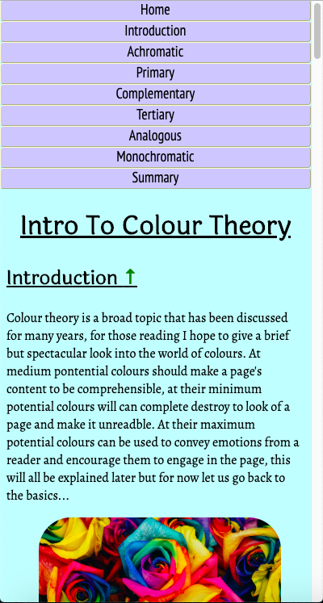
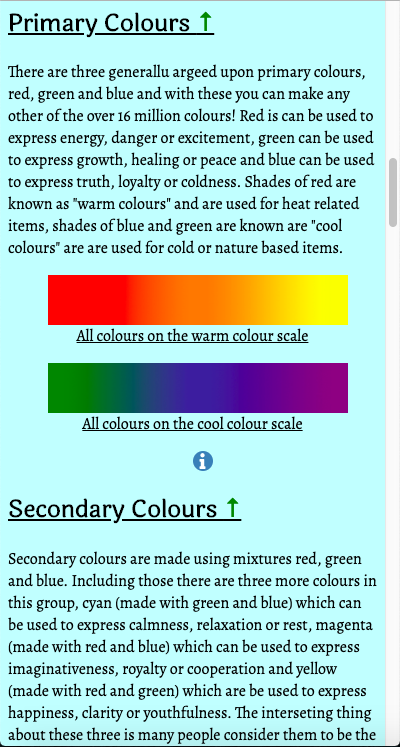
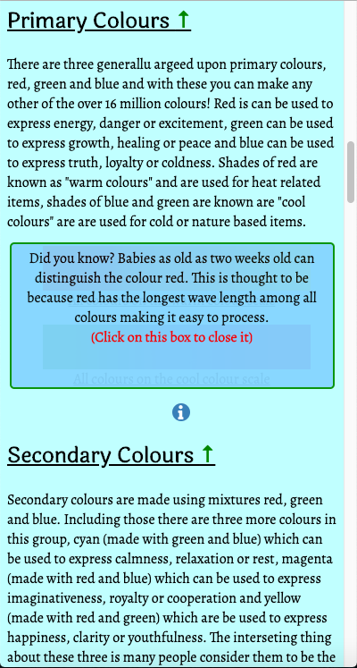
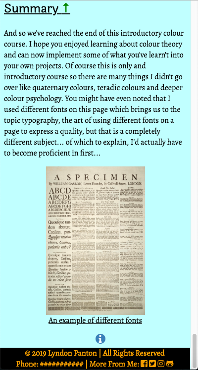
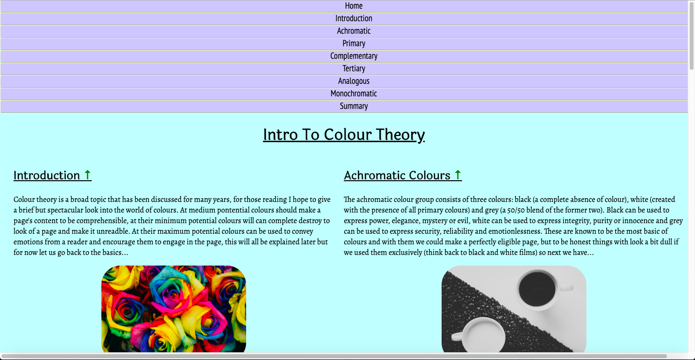
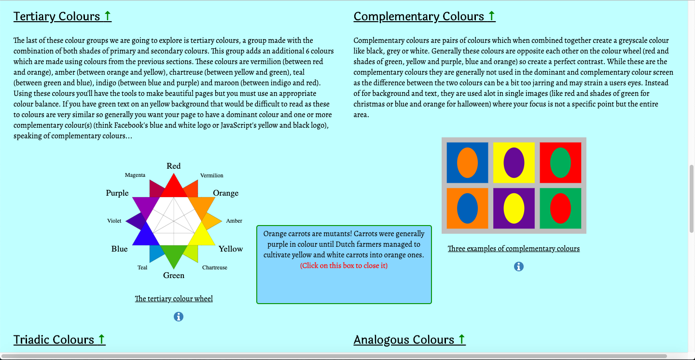
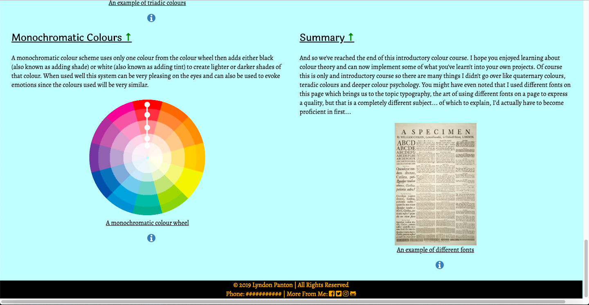

# Intro To Colour Theory

### How to Open
> 1. Go to the project's download folder
> 2. Right click the file named _index.html_
> 3. Select the _open with_ option
> 4. Choose the browser you want to open the project in

### How to Use
> This is a page which teaches the basics of colour theory
> Click the info icons for extra information

### Requirements
> 1. This project requires a broswer to run
> 2. To access full content make sure the browser has Javascript available and enabled

### Preview

